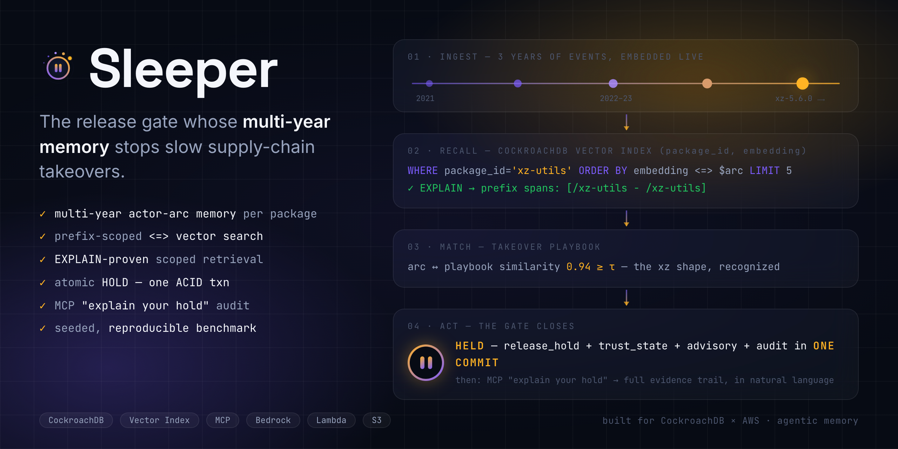
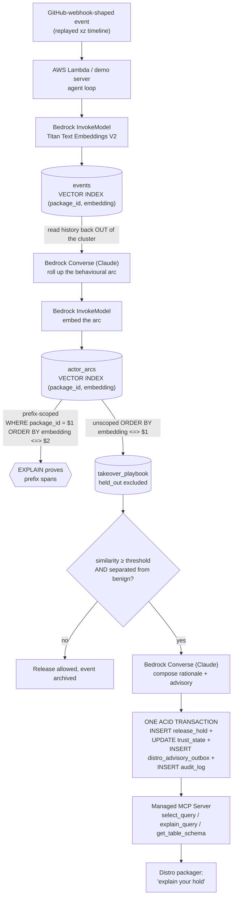

<div align="center">


# Sleeper

### The release gate that remembers.

A release-gate agent whose multi-year memory of every commit, email and maintainer change
recognises a slow-motion supply-chain takeover — the xz backdoor pattern — that no single code
review can see, and atomically **holds** the poisoned release before it ships.

**A 90-day slice of the xz attack is three innocuous commits. The signal only exists across years —
so the memory layer *is* the product.**



<br />

[**Demo**](#-quick-start) · [**How it works**](#-how-it-works) · [**Reproduce the numbers**](DEMO.md) · [**Architecture**](#-architecture)

<br />


</div>

---

## 🕯️ The problem

On 2024-03-29 a backdoor was found in **xz-utils** ([CVE-2024-3094](https://nvd.nist.gov/vuln/detail/CVE-2024-3094)) — a
compression library running on essentially every Linux machine on Earth. It had been planted over
roughly two and a half years by a contributor who built trust one innocuous commit at a time:
real bug fixes, plausible mailing-list posts, patient helpfulness toward an exhausted sole
maintainer, two sockpuppet accounts pressuring him to hand over control, and finally release-signing
authority.

**No single commit was suspicious. No single code review could have caught it.** The tell only
existed in the *shape of the arc*: a new account's unusually fast rise, a concentration on build
machinery rather than library code, pressure accounts with no code that vanished the moment the
handover completed, and a maintainer who ended up reviewing his own release artifacts.

It was found five weeks after the poisoned tarball shipped, because one engineer got curious about
**500 ms of unexplained SSH login latency**. That is not a process. That is luck.

## 🌒 What Sleeper does

Sleeper watches a package the way no human reviewer can: continuously, for years, remembering
everything. When a release is about to go out, it rolls the actor's entire trajectory into one
behavioural arc, searches its own memory, compares that arc against known takeover shapes — and if
it matches, it **holds the release atomically**, with an audit trail a downstream distro packager
can query in one statement.

Replaying the real public xz timeline, Sleeper holds at the 5.6.0 upload — the moment the backdoor
actually shipped, and 34 days before the real world noticed — 5.6.0 went out on 2024-02-24, the
backdoor was disclosed on 2024-03-29. Both dates are in `data/xz-timeline.json`, with sources.

> The xz replay is a ground-truth demo of a real incident, not a benchmark. Accuracy is measured
> separately, on held-out synthetic arcs, by `npm run bench`. The two are reported apart on
> purpose — see [DEMO.md](DEMO.md).

## ⏱️ Why an agent, not a cron job and a rule

**A stateless handler decides on its input. This decision has no input.** The events the 5.6.0
assessment reads span **984 days** — 2021-06-15 to 2024-02-24 (`data/xz-timeline.json`). No webhook
payload carries that, and there is nothing to hand a rule. The thing being classified has to be
*constructed* at decision time: `actorHistory` and `packageHistory` (`src/memory.ts`) read the trail
back out of the cluster, bounded by the assessment timestamp, and `buildArc` (`src/agent.ts`) rolls
it into one behavioural arc that is then embedded and searched against. The object of the decision
does not exist until the agent builds it.

**A rule set is written after the attack it catches.** This repo *contains* those rules — tenure,
privilege-escalation speed, build-system concentration, no-code pressure accounts, all of them in
`src/signals.ts` — and bars every one of them from voting. Adding a new takeover shape is a row in
`takeover_playbook`, not a code change: `npm run seed` inserts arcs from `data/synthetic-arcs.json`,
and the gate matches against whatever is in the table.

**An app answers; an agent acts.** The retrieval result is never rendered to a human as an answer.
It commits four writes in one transaction — `release_hold`, `trust_state → 'held'`,
`distro_advisory_outbox`, `audit_log` (`commitHold`, `src/memory.ts`) — and the release is blocked.
And because it acts rather than answers, it has to be able to decline: with no benign neighbour
retrieved there is nothing to contrast against, so `decide()` (`src/decide.ts`) treats the margin as
zero and refuses to hold rather than acting on a similarity score alone.

## 🧠 How it works

The premise is that **the memory layer is the product**. A 90-day slice of this attack is three
innocuous commits; the signal only exists across years of accumulated context. So the decision is
not made on the incoming event — it is made on what the incoming event means given everything
already in the database.



Four details that matter:

**The agent never reads the seed file at decision time.** Events are ingested into CockroachDB,
and the arc is rebuilt by reading that history *back out of the cluster*, filtered to what was
knowable at the assessment timestamp. The database is the memory, not a log of it.

**The gate is two-sided.** A bare "similarity to a known takeover ≥ X" rule cries wolf on any
contributor who is new and prolific — which describes most good first-time maintainers. Sleeper
holds only when the arc is both close to a takeover shape *and* meaningfully closer to it than to
the nearest ordinary-contributor shape. Several benign arcs in the playbook are written to
superficially resemble takeovers (fast rise, handover, brand-new account) so that test has teeth.

**Structural signals are evidence, not votes.** Tenure, privilege-escalation speed, build-system
concentration and no-code pressure accounts are computed from memory and cited in the hold
rationale — but they do not participate in the decision. Mixing a hand-tuned rule engine into it
would quietly turn the benchmark into a measurement of the rules rather than of the memory.

**What is stored is behaviour, never a verdict.** The arc summariser is told to describe the *shape*
of a trajectory — how the actor entered, how fast trust escalated, what kinds of change they
concentrated on, what other accounts did around them — and is explicitly forbidden from saying
whether this is an attack, and from naming the package or any real person (`ARC_SYSTEM`,
`src/agent.ts`). That constraint is load-bearing, not stylistic. If the summariser were allowed to
write the conclusion, the vector it produces would encode the model's opinion, retrieval would be
decoration on a judgement already made, and the playbook would be scoring how confidently Claude
called something an attack instead of how closely the actor's behaviour matches a known shape. The
anonymity half is the same argument: an arc that names the package or the person lets identity leak
into a vector space that is supposed to hold nothing but shape.

## ⚖️ Two choices that look wrong on paper

Both are described above as mechanism. Here is the alternative each one rejected, and the price it
pays for it.

**A two-sided gate instead of a similarity threshold.**

- *Rejected:* a single "similarity to a known takeover ≥ X" cut. It holds every fast-rising new
  maintainer — which describes most of the good ones.
- *Cost accepted:* an attacker who mimics an ordinary contributor closely enough sits inside the
  margin and passes. `npm run bench` measures that on held-out arcs rather than hiding it, and
  several benign playbook arcs are written to resemble takeovers on the surface (fast rise,
  handover, brand-new account — `data/synthetic-arcs.json`) so the margin is not free to earn.
- *Not a novelty claim:* it is a margin rule with two hyperparameters (`holdAt`, `minMargin`) fitted
  by leave-one-out over 8 playbook arcs (`scripts/calibrate.ts`). It is not a new algorithm. The
  defensible claim is narrower: for a gate that blocks releases this is the correct product
  decision, it has an abstain path, and its cost is written down rather than discovered later.

**Rules computed, then barred from voting.**

- *Rejected:* letting tenure, escalation speed, build-system share and pressure accounts contribute
  to the score — the obvious move, since those are the tells everyone cites about xz.
- *Why not:* a rule set is a snapshot of last year's attack. It catches the shape someone already
  wrote down, and the next takeover that rhymes without matching needs a code change to catch. A
  retrieval library grows by adding a row to `takeover_playbook` and editing nothing. Benchmark
  hygiene is the second reason: a hand-tuned rule engine inside the decision path turns the
  benchmark into a measurement of the rules rather than of the memory.
- *Cost accepted:* structural tells alone will never hold a release. If the arc lands far from every
  shape in the playbook, `decide()` allows it no matter what `src/signals.ts` computed.

## 🪐 CockroachDB tools used

| Tool | How it is used |
|---|---|
| **Distributed Vector Indexing** | Three inline `VECTOR INDEX` declarations (`sql/schema.sql`). `events` and `actor_arcs` are indexed on `(package_id, embedding vector_cosine_ops)` so ANN search is *prefix-scoped* to one package's own history; `takeover_playbook` is indexed unscoped, because a takeover shape learned anywhere must be matchable from anywhere. Retrieval uses `<=>` cosine ordering, and `EXPLAIN` is run on the live query to prove the `prefix spans` pre-filter — asserted in the test suite, not just claimed. |
| **ccloud CLI** | `scripts/provision.sh` — 328 lines, idempotent, with a `--dry-run` that prints every command before anything touches your org. Creates the Basic cluster, the database, and three identities with deliberately different scopes: `ingest_svc` (INSERT/SELECT on `events` only), `gate_svc` (the decision path, granted no DELETE so a hold and its paper trail are append-only to it), and a read-only service account for the MCP audit surface. The privilege split is applied as real SQL, not described in prose — `REVOKE admin` included, because `ccloud cluster user create` makes admins and a split where both sides are admin is decoration. **The running demo uses a single identity**; the split is provisioned and verifiable, not yet wired into `src/db.ts`. See [DEMO.md §1](DEMO.md#provision-the-cluster-cockroachdb-ccloud-cli). |
| **Managed MCP Server** | Serves the entire audit surface — the reads a distro packager performs on a hold they did not create. `src/mcp.ts` drives all four documented tools: `get_table_schema` for the evidence tables as the cluster itself describes them, `explain_query` so the `prefix spans` proof is produced *server-side* rather than by us, `select_query` for the hold and its trail, `show_statement` for session introspection. Every documented limit is enforced locally before a call leaves — one statement per call, 16,384 chars, and an explicit `LIMIT` on every SELECT, because the server's implicit `LIMIT 25` would otherwise present a truncated evidence trail as a complete one. Argument names are bound to the schema the server advertises in `tools/list` rather than hardcoded, since the published docs name the tools but not their input schemas. The write path never uses MCP: one statement per call cannot express the four-write HOLD, and pretending otherwise would break the invariant the project rests on. `npm run mcp:audit` drives the whole path end to end and aborts if `tools/list` advertises any write tool. **Not yet exercised against the live Cloud server** — that needs a service-account API key we do not have; what is proven is the client, against a fake transport, in 82 tests. |

The single ACID transaction is the reason this is CockroachDB and not a vector database bolted
onto a relational one: the vector search that produces the decision and the state change that acts
on it are the same system, so a hold can never half-land. There is no window where a release is
blocked with no advisory queued, or an advisory goes out for a hold that rolled back. That
invariant is tested by killing a transaction mid-write and asserting nothing survives.

## ☁️ AWS services used

| Service | How it is used |
|---|---|
| **Bedrock — Titan Text Embeddings V2** (`InvokeModel`) | Embeds every event on write and every arc summary before retrieval. 1024 dimensions, matching `VECTOR(1024)`. |
| **Bedrock — Claude** (`Converse`) | Rolls a multi-year event history into one behavioural arc summary, then composes the hold rationale and the distro advisory. |
| **Lambda** | Hosts the agent loop (`src/handler.ts`), webhook-triggered: one event arrives, is embedded, written, and assessed against everything already in memory. |

## 🚀 Quick start

```bash
npm install
cp .env.example .env          # DATABASE_URL + Bedrock model ids

npm run schema                # tables + vector indexes
npm run seed                  # playbook and held-out arc corpora
npm run calibrate             # fit thresholds on the playbook split only
npm start                     # http://localhost:3000 -> press "Replay the xz timeline"
```

Terminal equivalents: `npm run replay`, then `npm run explain -- --hold <uuid>`.

No AWS account? `SLEEPER_OFFLINE=1` swaps Bedrock for a deterministic stand-in so the schema, the
SQL, the vector indexes and the transaction semantics all run against a local CockroachDB node.
It proves the wiring and detects nothing — see [DEMO.md §4](DEMO.md#4-running-without-aws-credentials).

Full setup, reproduction steps and benchmark methodology: **[DEMO.md](DEMO.md)**.

## 🧪 Tests

**207 tests.** On a fresh clone with no database and no AWS account, `npm test` prints
`168 passed | 39 skipped (207)` — that is the honest output, and it is the one you should expect.
The 39 need a reachable cluster; point `DATABASE_URL` at one and it becomes `207 passed`.

The gate is reachability, not configuration: a `DATABASE_URL` that is set but does not answer skips
those 39 and prints why, naming the host and the driver's error. A stale credential should not look
like broken code.

The cluster-backed 39 assert the `prefix spans` plan line on both the neighbour query *and* the
query that actually makes the decision, held-out exclusion, all-or-nothing hold and unhold
transactions, ingest idempotency under a retried delivery, and point-in-time correctness (a
decision can never see an event from after its own assessment timestamp).

That cluster does not have to be a Cloud cluster. `cockroach start-single-node --insecure` runs the
whole suite, vector indexes included, with no AWS account and no CockroachDB Cloud subscription —
see [DEMO.md](DEMO.md). It reproduces the mechanism and the query plans; it cannot reproduce the
accuracy figures, which need real embeddings.

## 📊 Benchmark

`npm run bench` reports recall@k, hold recall, false-positive rate and p50/p95 latency — measured
**only** on held-out arcs, against a lexical baseline, with the xz timeline excluded from every
figure. It refuses to run in offline mode, because a quality number computed on a hash function
would be a property of the hash function. **No accuracy figure has been produced yet**; that needs
Bedrock.

Latency is separable, and is measured. `npm run bench -- --latency-only` runs offline by design: the
timed window is a CockroachDB ANN round trip plus arithmetic, and its cost is a property of the
vector index, the row count and the 1024-dimension width — a stand-in vector descends exactly the
same index as a Titan one. The mode reads its probe vectors with a query that selects no `label`
column, so the ground truth is not even in the process and no accuracy figure can be derived from
it. The measured p50/p95, the corpus size it was measured over, and a real `EXPLAIN` plan showing
the deciding query's `prefix spans` are in [DEMO.md](DEMO.md#results) — with the caveat that 8
searchable arcs is a floor, not a scale result.

## 🛡️ Production readiness

- **Access control** — `scripts/provision.sh` creates three identities with different scopes:
  `ingest_svc` (INSERT/SELECT on `events` only, so a compromised webhook can add to memory and do
  nothing else), `gate_svc` (the decision path), and a read-only service account for the MCP audit
  surface. **Honest caveat: the running demo uses one `DATABASE_URL` and one pool** — nothing in
  `src/` selects between the two SQL identities, so the split is provisioned and documented rather
  than exercised. Wiring the ingest path to its own credential is a change to `src/db.ts`, not a
  change to the schema. The MCP half *is* enforced: `src/mcp.ts` implements only read tools, and
  `npm run mcp:audit` aborts if the server advertises a write tool.
- **Observability** — one JSON line per event on stderr, correlated by `corrId` across a whole
  assessment: `ingest.written`, `arc.built`, `retrieval.explained` (carrying whether the plan was
  prefix-scoped), `decision.made`, `hold.committed`, `mcp.fallback`. `decision.made` is emitted for
  **allow** as well as hold — before this the audit trail was written only inside `commitHold`, so a
  release the gate assessed and let through left no trace anywhere. `/api/health` reports database
  reachability with latency, which inference path is live, the resolved MCP mode, and whether
  thresholds are fitted or fallback.
- **Serialization retry** — `withTransaction` retries SQLSTATE 40001 with backoff. CockroachDB is
  SERIALIZABLE, and without this a webhook arriving during a replay could contend on `trust_state`
  and drop the hold entirely.
- **Idempotency** — `events` carries a unique `event_key`; a retried webhook delivery cannot
  double-write the memory the decision is derived from. AWS retries by default, so this is *when*,
  not *if*.
- **Reversibility** — `commitUnhold` clears a hold in one transaction and never deletes it: the
  resolution, who made it and why are appended, so a false positive leaves a record rather than a
  gap. A gate with no exit is not installable.
- **Embedding provenance** — every vector stores the model that produced it, and the model id is
  part of the playbook index prefix, so a corpus written by a different embedding model cannot be
  searched at all rather than silently returning meaningless neighbours.
- **Failure modes** — the hold is all-or-nothing under an explicit rollback test; the connection
  pool is closed per Lambda invocation because a socket held across an execution-context freeze
  comes back dead; a decision with no benign neighbour to contrast against refuses to hold rather
  than passing on a similarity score alone.
- **Point-in-time integrity** — every history read is bounded by the assessment timestamp, so a
  replay cannot leak hindsight into a past decision.
- **Auditability** — every hold carries the matched arc, the similarity, the threshold in force,
  the `EXPLAIN` verdict and the structural evidence, in queryable rows rather than in logs.
- **Honest thresholds** — fitted by leave-one-out on the playbook split, never on the evaluation
  set, and the fitted file is gitignored so a threshold from someone else's model cannot silently
  move the gate.

## ⚠️ If Sleeper is wrong

A false positive here is not a spam-folder mistake. It delays a *security* release — the class of
release that is most expensive to delay — and it queues an advisory to Debian, Fedora and Arch
describing the behaviour of a named contributor. Sleeper decides on behaviour, not on proof of
compromise, so it will eventually be wrong about someone. What exists in code against that:

- **The margin gate, and an abstain path.** `decide()` requires separation from the nearest
  ordinary-contributor arc, and refuses to hold at all when no benign neighbour was retrieved to
  contrast against (`src/decide.ts`).
- **The rationale may not assert intent.** `RATIONALE_SYSTEM` (`src/agent.ts`) instructs Claude to
  state what the memory layer observed and never to assert intent or accuse a named person; the
  advisory must say the hold is behavioural rather than a confirmed vulnerability.
- **Specificity is not free.** Several benign arcs in the playbook are written adversarially, so an
  arc has to be closer to a takeover shape than to a plausible innocent one that shares its
  surface features.
- **The hold is advisory.** It writes rows: a `release_hold`, a trust status, and an advisory
  *queued* in `distro_advisory_outbox` with `sent = false`. Nothing in `src/` sends it and nothing
  pulls an artifact from anywhere — a packager reads the hold and its evidence through the MCP audit
  surface and decides.
- **A reversal is recorded, not erased.** `commitUnhold` (`src/memory.ts`) updates the hold in place
  with who cleared it, when and why, queues a *retraction* advisory, and appends a second audit row,
  all in one transaction. It never DELETEs, because "we held your release and then erased the
  evidence that we did" is a worse story than the false positive it covers up.

`npm run bench` reports a false-positive rate on held-out arcs. It has not been run against real
embeddings, so no value for it is claimed anywhere in this repo — see
[Not built](#-not-built-deliberately).

## 🔭 What this is not

- **Not UEBA or insider-threat analytics.** Those score deviation from an entity's *own* learned
  baseline. Sleeper computes no per-actor baseline anywhere — `decide()` (`src/decide.ts`) receives
  playbook matches and nothing else. It matches an arc against a labelled library of adversary
  trajectory shapes and requires separation from the nearest ordinary shape. Case-based reasoning,
  not anomaly detection.
- **Not Socket.dev or OpenSSF Scorecard-style structural scoring.** Those heuristics exist here
  (`src/signals.ts`) and are explicitly barred from deciding. The refusal is the move, not the
  heuristics.
- **Not RAG over logs.** Nothing is answered to a human. Retrieval is the actuator: its output goes
  straight into the four-write transaction that blocks the release (`commitHold`, `src/memory.ts`).
- **Not MITRE ATT&CK-style playbook matching.** The match is fuzzy — cosine similarity over
  LLM-written trajectory summaries rather than rule or indicator matching — and it requires a benign
  contrast that the rule-based version has no notion of.

## 🚧 Not built (deliberately)

One package, one flow, done deeply. No multi-package dashboard, no user accounts, no Bedrock
Agents orchestration layer, no multi-region configuration, no second demo scenario. S3-backed
tarball diffing is described in the architecture but is not wired in this build.

Known gaps, stated rather than buried:

- **The Lambda is not deployed.** `src/handler.ts` is written, typechecked and unit-tested against
  its own routing, but nothing has been pushed to AWS.
- **The MCP client has never talked to the live Cloud server.** It needs a service-account API key
  we do not have. What is proven is the client: 82 tests against a fake transport, including
  recorded payload fixtures and the permission-denied and `isError` paths.
- **No accuracy figures exist.** `npm run bench` refuses to run offline, and it refuses thresholds
  fitted by the offline stand-in — both deliberately. Recall and false-positive rate require real
  embeddings, so they are absent rather than approximated. Latency *has* been measured, offline and
  labelled as such (see Benchmark above); it is a property of the index, not of the model. The
  corpus it was measured over is 8 searchable arcs, which is a floor and is stated as one.
- **The replay still takes a configured suspect actor.** The webhook path derives the actor from the
  event, but `npm run replay` is pointed at one. Deriving candidates from memory alone is the honest
  next step; today the demo is told where to look, and a real deployment would not be.
- **The privilege split is provisioned, not exercised** — see Production readiness above.

Nothing in this README claims a capability the code does not have; where something is pending it
says so. That sentence is meant to be falsifiable — if you find a counterexample, it is a bug.

## 📄 License

MIT — see [LICENSE](LICENSE).

---

<div align="center">
<sub>Built for the CockroachDB × AWS Agentic Memory Hackathon.</sub>
</div>
